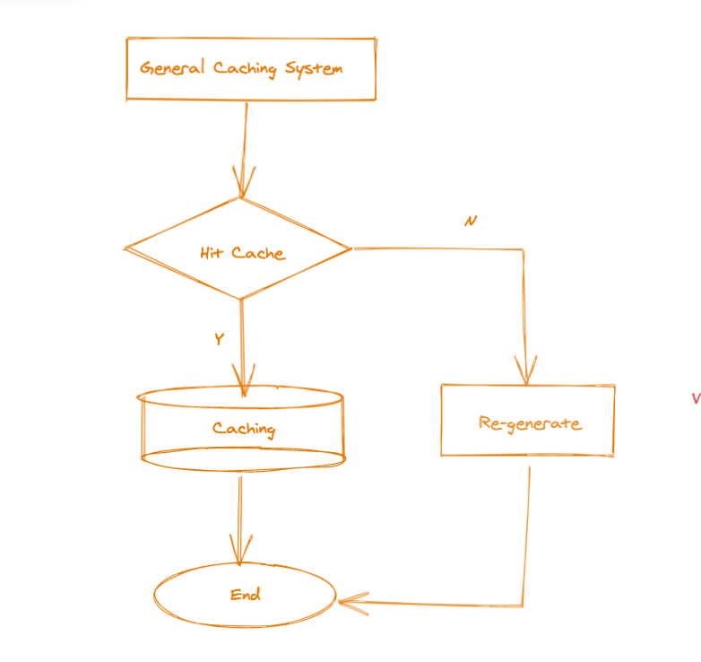
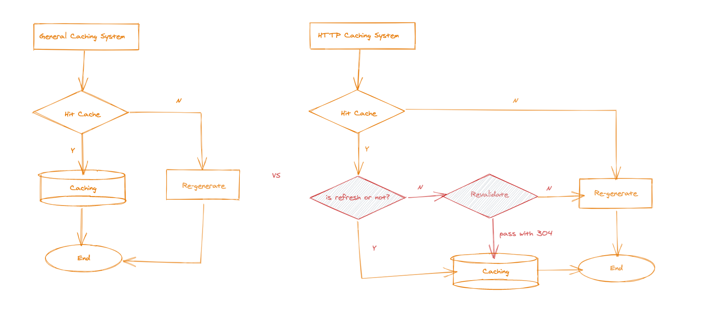
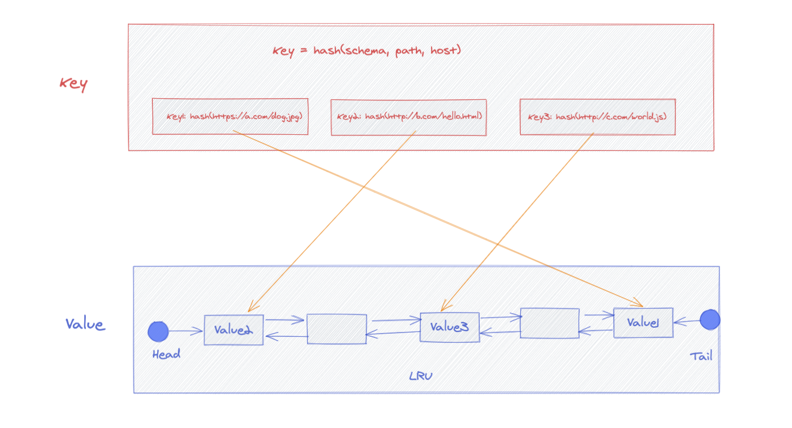
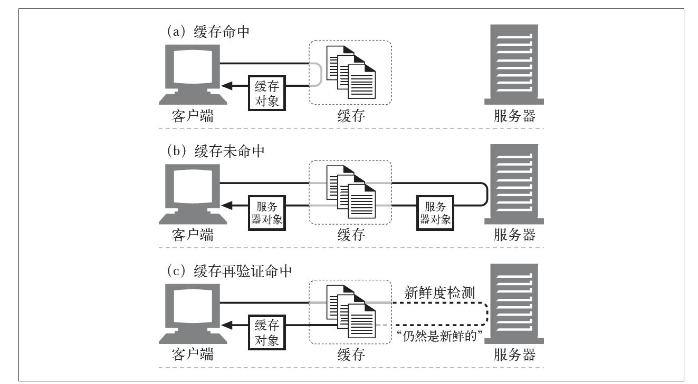
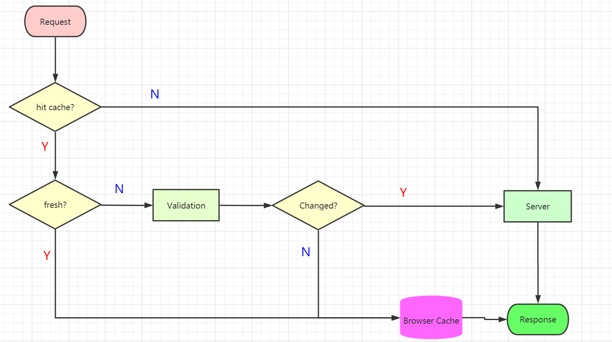
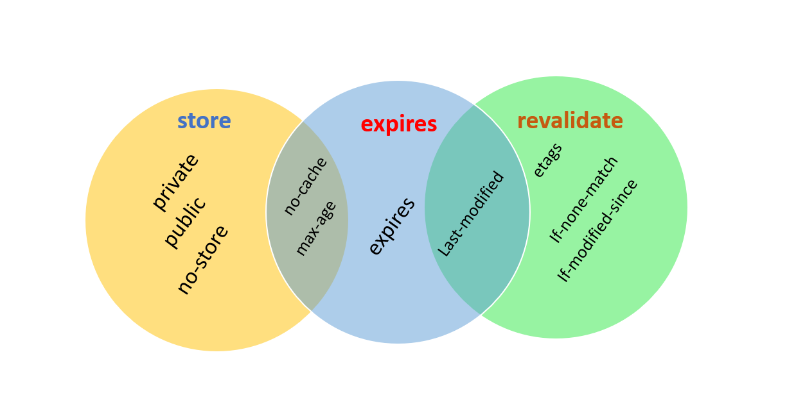
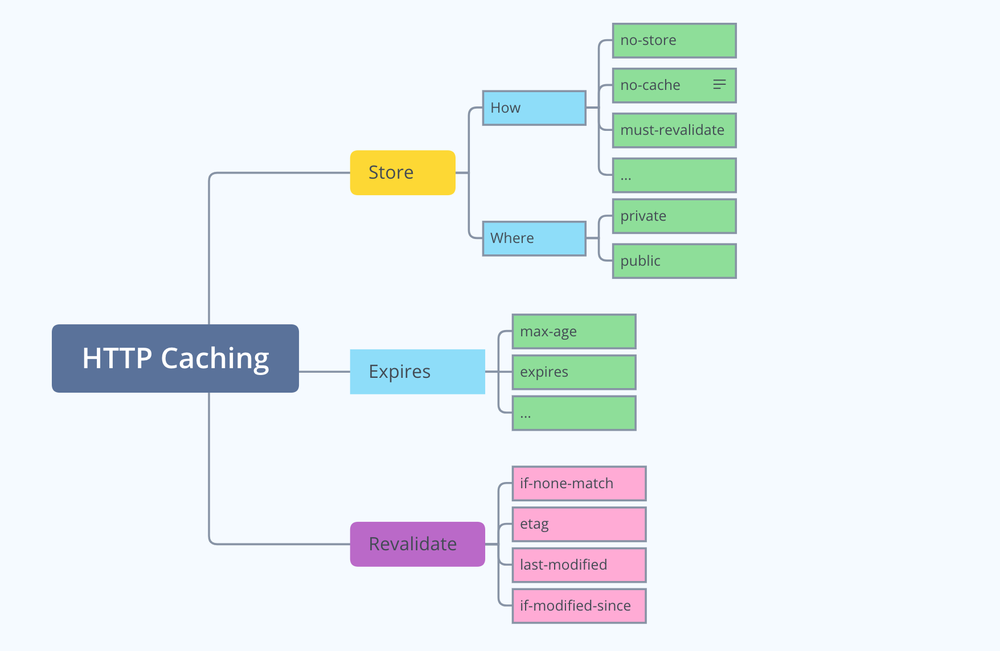
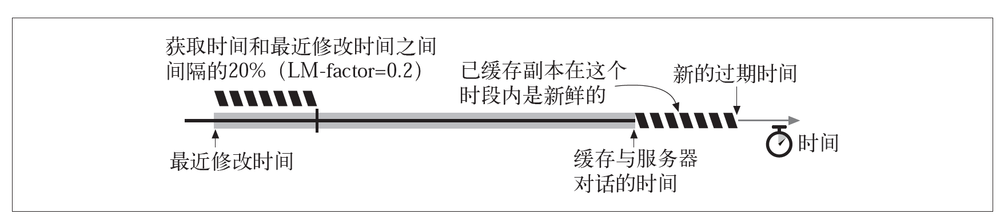

# HTTP CACHING

> *Cache* is a hardware or software component that stores data so that future requests for that data can be served faster.

---

### AGENDA

- Why we use caching?
- HTTP Caching flow?
- HTTP Caching mechanism: storeage, expired, revalidate
- Heuristic Expiration
- Demo

---

### Start with A Scenario


**Response Headers:**

```http
HTTP/1.1 200 OK
content-length: 39409
last-modified: Sun, 21 Mar 2021 03:34:04 GMT
```


### TWO QUESTIONS

1. What will happen when we refresh the page? Is there a cache we could use?
2. If we set a header with `cache-control: no-cache`, What will happen when we refresh it again?

---

### The problem HTTP Caching solves?

- Frequently request the same resource repeatedly?
- Consistency issues caused by caching?

---

### General Caching System?



---

### HTTP Caching System


---

### General Caching System vs HTTP Caching System



---

### Two QUESTIONS
1. How to quickly determine whether the cache exists?

2. When HTTP Caching is cleaned up?


Answers:



---

### HTTP CACHING STATES



---

### CACHING PROCESS FLOW



---

### HTTP CACHE MECHANISM




### Cache-Control Headers



---

### Heuristic Expiration



Typically,  `freshness_time = (downloaded_time - last_modified_time) * 10%`

See chromium source code [here](https://github.com/chromium/chromium/blob/99314be8152e688bafbbf9a615536bdbb289ea87/net/http/http_response_headers.cc#L1007)

---

### 👨‍🎓 DEMO👩‍🎓

> The task:
>
> - Write a `revalidate` function which handle revalidate logical

```js
function revalidate(req, res) {
    // generate etag
    
    // revalidate - 304
}
```

---

### THANK YOU

**Useful links && reference**

- https://tools.ietf.org/html/rfc2616#section-14.9
- https://tools.ietf.org/html/rfc7234
- [HTTP Definitive Guide](https://www.amazon.com/HTTP-Definitive-Guide-Guides/dp/1565925092)
- https://developer.mozilla.org/zh-CN/docs/Web/HTTP/Headers/Cache-Control

**Contacts:**
- syncviip@gmail.com
- https://0x400.com

